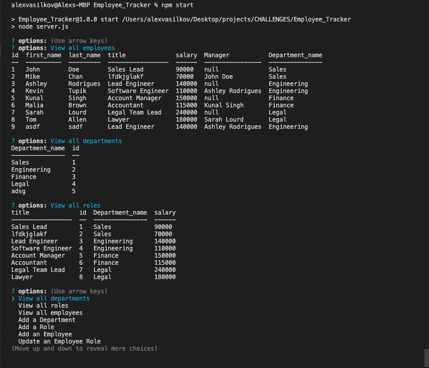

# Employee Tracker
1. [ Description. ](#desc)
2. [ Questions.](#ques)
3. [ Screenshot.](#scrsh)

## Description:
### command-line application to manage a company's employee database, using Node.js, Inquirer, and MySQL.

## Questions:
### My gitHub profile:
## https://github.com/Alex2055
### Email me:
## alexfromnashville@gmail.com

 #
 

    